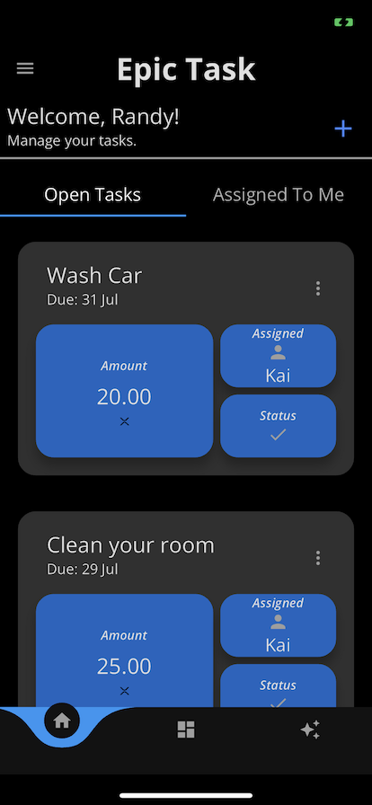

# Epic Task Flutter Frontend

## Overview

Epic Task Flutter Frontend is a mobile app built using Flutter to interact with the Epic Task backend API. 

## Features

- User authentication and registration
- Create, view, update, and delete tasks
- Assign tasks
- Track task progress and status
- Responsive and intuitive user interface

## Screenshots




## Getting Started

1. Clone the repository:

   ```bash
   git clone https://github.com/kaitech-corp/epictask.git
   cd services/frontend_mobile
   flutter pub get
   flutter run

## Contributing

Contributions are welcome! If you find a bug or want to add a new feature, please open an issue or create a pull request. Make sure to follow the project's coding style and guidelines.

## Resources

Find more info here [EpicTask](epictask.app/)

